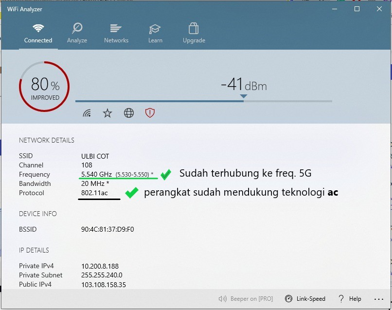

# infra team
Infrastructure and Technical Support

## Layanan Broadband wifi kampus

Nikmati layanan maksimal broadband di lingkungan kampus dengan menggunakan wifi, untuk bisa menikmati bandwidth yang optimal pastikan perangkat kakak mendukung teknologi 802.11ac yang bekerja pada frekwensi 5Ghz. Untuk mengecek apakah perangkat kakak sudah mendukung teknologi ac 5Ghz ikuti langkah berikut :
1. Install Aplikasi [WiFi Analyzer](https://apps.microsoft.com/store/detail/wifi-analyzer/9NBLGGH33N0N) pada perangkat kakak
2. Buka aplikasi tersebut, pada laman utama(connected), pastikan Frequency menggunakan 5 Ghz dan Protocol 802.11ac

3. Apabila perangkat kakak belum mendukung teknologi 802.11ac 5G, tidak usah berkecil hati. Kakak tinggal membeli saja **USB WiFi AC 5G** di toko online kesayangan kakak.
